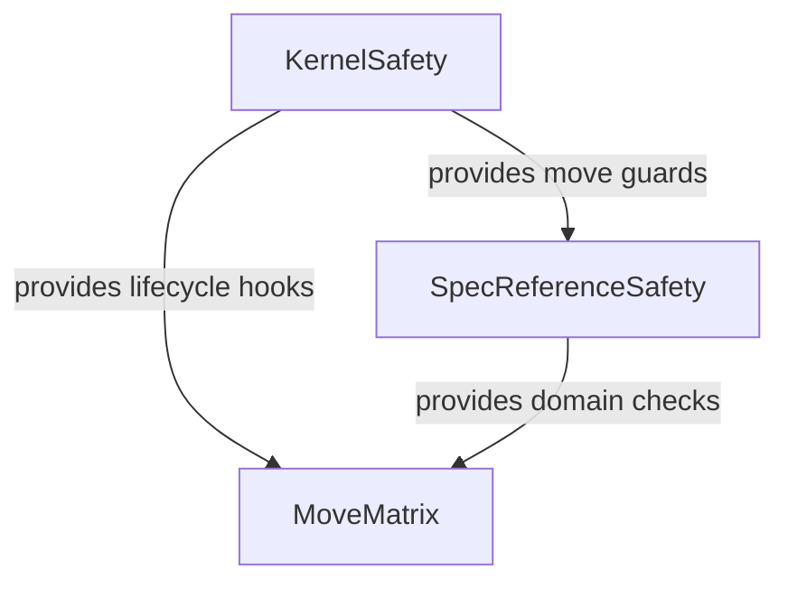

<!-- aligned-structure:v2 -->
# Cross-Repository Entity Move Safety

## Motivation
The approved migration route must allow cross-repository moves when repository-local references, target readiness, filesystem constraints, and batch closure are verified. The contract must default to enabling safe moves rather than treating repository boundaries as an unconditional blocker.

## Reading Order
1. [Shared move kernel](../../workflow-tools/memory-kernel/src/storage/move_kernel.rs)
2. [Specification move domain](../../workflow-tools/spec/crates/spec-api/src/move_domain.rs)
3. [Entity move execution rule](../../workflow-tools/.agents/instructions/workflow/entity-move-execution.instructions.md)
4. [Kernel child contract](../../workflow-tools/.workflow-tools/spec/specs/c095bb6b-f343-4ae9-9282-0d51a06d099a/body.md)
5. [Spec-domain child contract](../../workflow-tools/.workflow-tools/spec/specs/867cd511-5bb6-494f-8dff-a150f4953f02/body.md)
6. [Test child contract](../../workflow-tools/.workflow-tools/spec/specs/3b421996-f4f5-4d66-91cb-70d2dbf90233/body.md)

## Component Relationship Map

## Shared Invariants
- `allow_cross_repository` defaults to `true`; a caller may explicitly disable cross-repository planning.
- Any reference not visible from the destination is a hard preflight blocker, regardless of repository topology.
- Cross-repository plans require code-reference existence checks, destination-local batch closure, filesystem/volume compatibility, sequential execution, reconciliation after every batch, and fixed commit ordering.
- Production migration remains journaled and read-back validated.

## Examples
A spec moved from `workflow-tools` to `workflow-tools/audit` is supported only when all references resolve from the audit repository, the destination store can initialize, the batch is closed under destination-local relations, and the filesystem rename preflight passes.

## Scope
This parent coordinates the kernel, specification-domain, and test/benchmark contracts. It does not own implementation details of any child.
